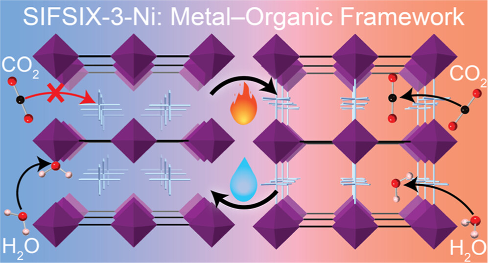

::: {.pub-grid}

::: {.pub-index-col}

1

<a href="https://doi.org/10.1021/jacs.3c11503" class="pub-url-link" target="_blank">
journal URL <i class="bi bi-box-arrow-up-right"></i>
</a>
:::

::: {.pub-cite-col}
Probing Structural Transformations and Degradation Mechanisms by Direct Observation in SIFSIX-3-Ni for Direct Air Capture

M. L. Barsoum, J. Hofmann, H. Xie, Z. Chen, S. M. Vornholt, R. dos Reis, N. Burns, S. Kycia, K. W. Chapman, V. P. Dravid, and O. K. Farha

*J. Am. Chem. Soc.* **2024**, *146*, 10, 6557–6565.

<small>(#M.L.B. and J.H. contributed equally)</small>
:::

::: {.pub-image-col}

:::

:::
